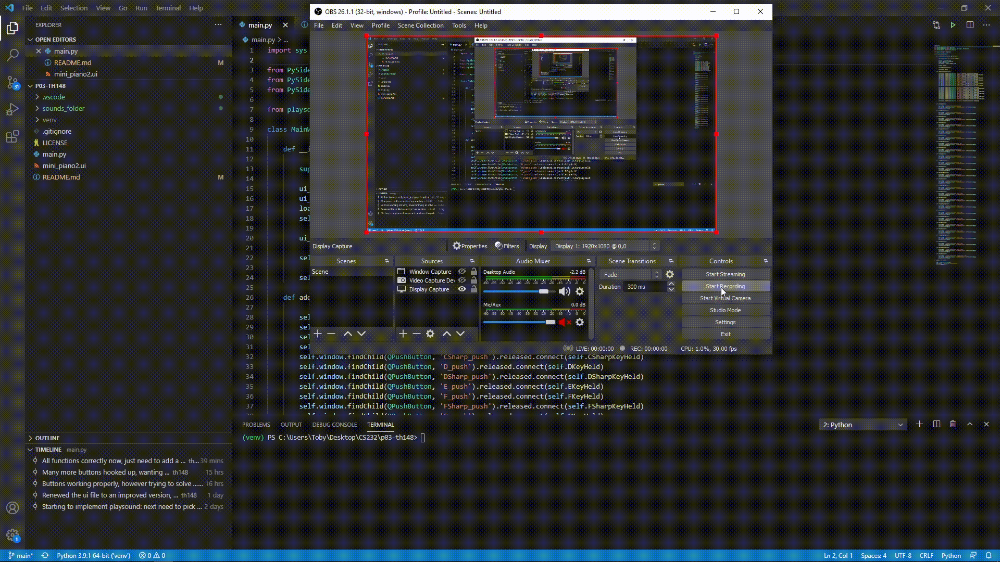

# p03-th148
GUI project - mini piano

Sound samples are from stgiga's Famicom Multichip Soundfont V2G
which is a wonderful soundfont by stgiga and others, at
https://musical-artifacts.com/artifacts/793

disclaimer: the sound files do not correspond to the notes of the piano
to which they are assigned. However, they are arranged in a somewhat
intuitive manner (low to high).

Special thanks to user https://github.com/map209 for the help
figuring out a roadblock in Qt Designer.

playsound library comes from https://github.com/TaylorSMarks/playsound
created by user https://github.com/TaylorSMarks
which was an immense help as an easy way to play the short .wav files!

Required installs:

pip install PySide2

pip install playsound

